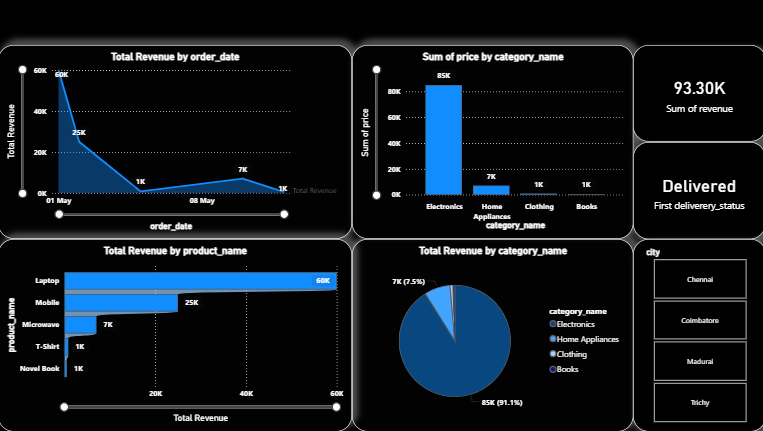

#  E-Commerce Sales Analytics Project

## 🎯 Project Overview
This project analyzes sales and customer data using SQL, Python, and Power BI to generate meaningful business insights.

## 🛠 Tools & Technologies
- MySQL
- Python
- Power BI

## 📁 Files Included
- ecommerce_analysis.sql → SQL queries
- sales_data.csv → Dataset
- analysis.py → Data analysis
- api.py → API integration
- db_connection.py → Database connection
- kpi.py → KPI calculations
- export_to_csv.py → Data export
- dashboard.pbix → Power BI dashboard

## 🔍 Key Features
- Sales analysis
- Customer insights
- KPI metrics
- Data visualization

##Dashboard Screenshoot

## 🚀 How to Run
1. Import the SQL file into MySQL
2. Load the dataset
3. Run SQL queries
4. Execute Python scripts
5. Open Power BI file for dashboard

## 📊 Output
The project provides insights on sales trends, customer behavior, and key performance indicators.
